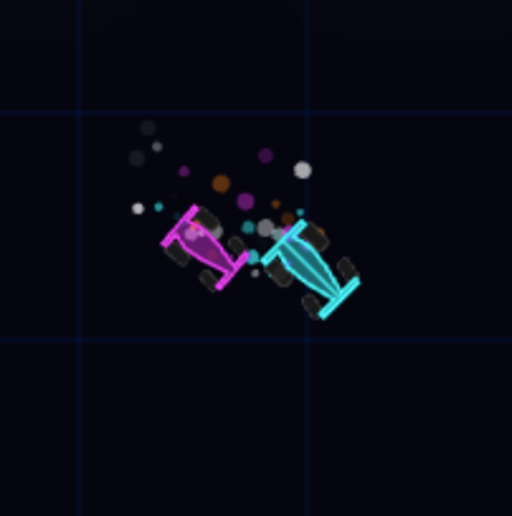
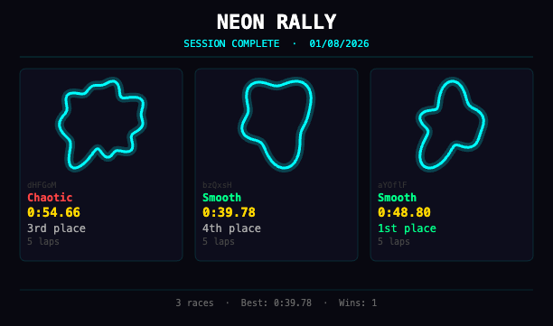

#  Neon Rally

Neon Rally is a drift-heavy top-down arcade racer that runs in your browser. It generates a new track every race — procedural circuits with shareable IDs, five AI opponents, and physics tuned to feel like the classic PC racer *Gene Rally*. Play with keyboard, gamepad, or touch. Install it as a PWA and it works offline.

[Play it](https://mostlymaths.net/neon-racer) — or paste a track hash like `#track=X7kP9m` to race a specific circuit.

---

## Quick Start

```bash
npx serve .
# or
python3 -m http.server 8080
```

Open `http://localhost:8080`. The splash screen runs first. Press any key, tap, or hit a gamepad button to dismiss it. Pick a track. Click **OK** on the controls overlay. Race.

---

## Controls

### Keyboard

| Key | Action |
|---|---|
| `↑` / `↓` | Gas / Brake |
| `←` / `→` | Steer |
| `Z` | Activate powerup / next race |
| `Space` / `Esc` | Pause |
| `D` | Toggle debug panel |

### Gamepad

| Input | Action |
|---|---|
| Right stick (axis 2) | Steer |
| `B` (button 1) | Gas |
| `X` (button 3) | Brake |
| `Y` (button 2) | Activate powerup / next race |
| `Start` (button 9) | Pause |

To remap controls, open the **Controls** overlay, click an action, then press the key or button you want. The game saves your bindings to `localStorage`.

### Touch (landscape)

| Zone | Action |
|---|---|
| Bottom-left | Steer left |
| Bottom-right | Steer right |
| Both bottom halves | Powerup / start race |
| Both top halves | Brake |
| Top half opposite steer | Lift gas |

Gas is automatic.

---

## Gameplay

You start sixth. Dead last. Five AI cars ahead of you on the grid.

The lights go out. Everyone crawls. Launch stiction bunches the pack together for the first few seconds — that is your only chance to make up ground before the first corner.

Then the track opens up. On straights you can tuck in behind an AI car and draft, picking up +1.5 speed. Pull out at the right moment and slingshot past. But do not get greedy into the corners. The AI pre-brakes. If you do not match that discipline, hard steering at high speed sends you into understeer. You slide wide. You lose time.

The game shakes when you bump another car. It rattles when you ride the grass. Five laps, by default.

**Session mode.** After each race you pick the next track or end the session. End it and the game builds you a poster — every race you ran, with minimaps, times, and final standings.

### Powerups

Powerups spawn along the track edges, deliberately off the racing line. You have to detour to collect them.

| Type | Colour | Effect |
|---|---|---|
| **S** (Sustained) | Green | ×1.35 top speed for ~1 s |
| **T** (Turbo) | Orange | ×1.8 top speed + acceleration burst for ~0.3 s |

You hold a collected powerup until you activate it. AI cars use theirs immediately. Both types taper off smoothly rather than cutting out hard. The HUD in the top-right shows your held powerup and active boost state.

---

## Track Sharing

Every track gets a unique 6-character ID. The URL updates automatically to `#track=aB3xK9`. Send that link to a friend and they get the exact same circuit.

You can also enter a track ID directly in the tuning panel.

---

## Time Attack & Challenges

After you finish a race, the overlay shows your time in `m:ss.cc` and a **Copy** button. The challenge URL encodes your lap count and split times at 25%, 50%, 75%, and 100% race progress.

Open a challenge URL and the target time appears in the pre-race overlay. During the race the HUD shows a live pace delta: ▲ if you are ahead, ▼ if you are behind. Powerup placement is deterministic per track, so both runs are fair.

---

## Track Difficulty

Tracks are built from polar harmonic curves:

`r(θ) = baseR + Σ amp_k · sin(k·θ + phase_k)`

Three tiers:

| Tier | Difficulty | Harmonics | Shape |
|---|---|---|---|
| **Smooth** | 0.2 | 3–4, medium amplitude | Nice and curvy |
| **Technical** | 0.5 | 5–7, moderate amplitude | Complex and curvy |
| **Chaotic** | 0.8 | 7–9, large amplitude | Wild and irregular |

All three are drivable. The higher tiers punish impatience.

---

## AI Opponents

Five cars. Each one rolls a random personality when the track loads:

- **Risk factor** (0.2–1.0): cautious cars brake early; aggressive ones carry speed into corners and sometimes crash.
- **Line offset** (inside ↔ outside): different cars take different racing lines.
- **Grip** (0.03–0.05): low-grip cars slide more.
- **Max speed** (9.5–10.5): some are faster on straights.

Two driving modes:
- **Waypoint** (1 car — Magenta): follows sampled waypoints, brakes for curvature, remembers mistakes.
- **Spline** (4 cars): follows a pre-computed speed profile. Green is the **ace** — fixed top-tier stats as a benchmark. Orange, Yellow, and Purple roll random skill attributes seeded from the track ID so shared tracks give identical AI behaviour.

### AI Learning (Waypoint Only)

The Magenta waypoint car keeps a simple caution memory. When it goes off-track, it records the segment. On later laps it lifts the gas earlier through that same stretch. The memory decays, so old mistakes are eventually forgotten. `pretrainAI` warms the memory on each new track so lap 1 is not a total disaster.

If the car gets stuck at near-zero speed for 0.2 s, it switches temporarily to spline mode — a reliable centreline follower — until it gets back on asphalt.

Watch the console for `[LEARN]` and `[USE]` events.

---

## Session Summary

When you end a session, the game generates a poster summarising every race:



Minimap thumbnail. Track ID. Difficulty label. Lap count. Finish time. Final place. Overall best time and win count at the bottom. You can share or download the poster via the Web Share API.

---

## Architecture

| File | Role |
|---|---|
| `src/app.js` | Bootstrap: splash → Pixi init → world → cars → track select → listeners → loop |
| `src/state.js` | Central mutable state object |
| `src/hud.js` | All DOM overlays |
| `src/trackManager.js` | Track rebuild, grid placement, AI warmup |
| `src/race.js` | Race state machine: progress, ranking, session flow |
| `src/gameLoop.js` | Per-frame ticker: inputs, physics, AI, collisions, camera, effects, HUD refresh |
| `src/splash.js` | Animated intro (separate PixiJS app) |
| `src/menu.js` | Track selector — 3 cards with minimap thumbnails, gamepad/keyboard navigable |
| `src/session.js` | Session summary canvas and overlay |
| `src/car.js` | Shared physics for player and AI |
| `src/ai.js` | Waypoint & spline AI, learning, drafting, recovery, skill randomisation |
| `src/track.js` | Procedural generation, seeded PRNG, track IDs, racing line, speed profile |
| `src/renderer.js` | Car sprites, camera, particles, skid marks (2000-segment cap), screen shake |
| `src/audio.js` | Tone.js engine and drift sounds |
| `src/controls.js` | Keyboard + gamepad mapping, remap UI, `localStorage` |
| `src/touch.js` | Zone-based touch controls |
| `src/powerups.js` | Spawn, pickup, activation, tapered boost |
| `sw.js` | Cache-first service worker |
| `manifest.json` | PWA manifest |
| `libs/controlHandling.js` | Low-level gamepad polling (from Destrier) |
| `libs/Tone.js` | Tone.js library |
| `index.html` | Entry point, import map, manifest link |

---

## Notes

- To show the tuning GUI, type `showTuning()` in the console. Or add `&tuning` to the URL hash.
- Skid marks are capped at 2000 segments to prevent overload on smooth tracks.
- The game loop runs at 45 fps to keep frame times stable.
- The service worker caches all assets. Use `Ctrl+Shift+R` to bypass the cache during development.

---

## License

MIT
